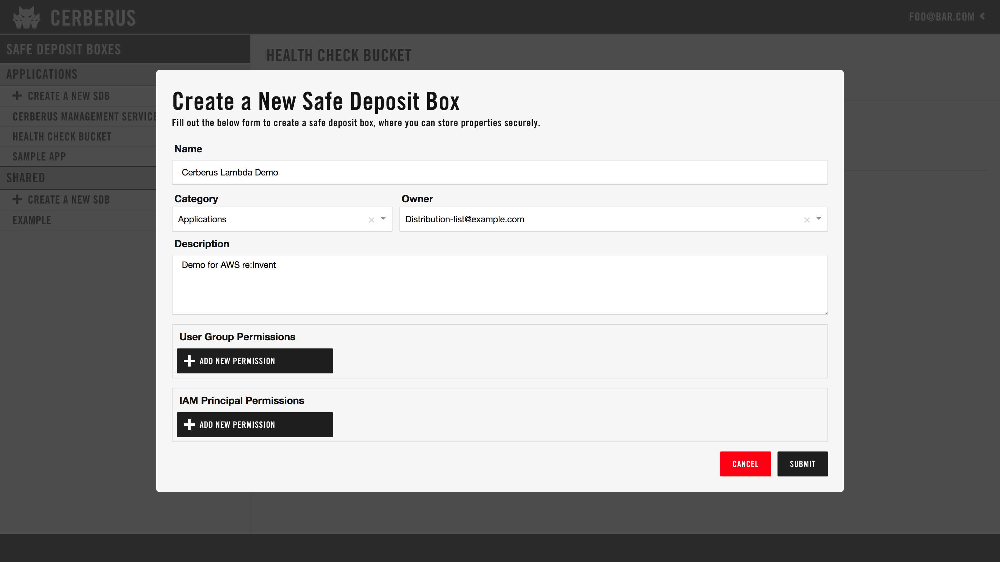
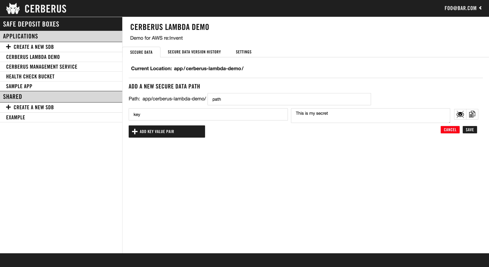

This is a quick start guide for application developers who want to use the Cerberus service.  This guide assumes a 
Cerberus environment has been setup as described in the [Administration guide](../administration-guide/creating-an-environment).

Cerberus is a complete solution to manage anything that you want to tightly control access to, such as API keys, 
passwords, certificates, etc. By the end of this document you will be able to provision a safe deposit box (SDB), set the 
correct permissions, and integrate a cerberus client library to access data from your application.  A safe 
deposit box (SDB) is a logical grouping of data with a single set of access controls.

# 1. Create a Safe Deposit Box

1. Login to the Cerberus [dashboard](dashboard) with your credentials.
1. In the left navigation bar, click the "+ Create a New SDB" button next to the Applications section.
1. Enter a descriptive name for your SDB.  If your app is "myexampleapp", use "My Example App".
1. The owner field is the Active Directory group that will have ownership and admin privileges for this SDB. Select one of the AD groups of which you 
   are currently a member.
1. Under "User Group Permissions", you can give additional Active Directory groups, that you are a member of, read or write access to the SDB. This is optional.
1. Under "IAM Principal Permissions", you can provide the AWS role name that will have either read or write access 
   to the SDB. This is optional. See "How to add an IAM Principal Permission" section below.
1. Click the "SUBMIT" button.

<a href="../../images/dashboard/create-new-safe-deposit-box-screen.png" target="_blank">

</a>

### How to add an IAM Principal Permission:
1. Under "IAM Principal Permissions", click the "+ Add New Permission" button.
1. Construct an IAM Principal ARN. See the example below. In this example, "1111111111111" is the account ID. The account ID in the ARN should be the account ID for the user's account.  See your company's internal documentation for the account ID that you should use. "ExampleAdminRole" is the base role. Please note that because Cerberus uses STS Auth, this IAM Principal ARN does NOT contain paths.
   ```
   arn:aws:iam::1111111111111:role/ExampleAdminRole
   ```
   
1. Select whether you want read or write permissions for this ARN.
1. Click "SUBMIT".
1. See [AWS STS Authentication](../authentication/aws-iam-sts-authentication) for more information.

# 2. Manage Data in your Safe Deposit Box

Data is stored using a path structure.  Note that the application name is normalized to be 
URL friendly.  So, if you had "My Example App" in the Applications category your root path will be 
"applications/my-example-app".  From there you can add sub-paths to store key value pairs.

Cerberus will allow an SDB to contain a folder structure with many subpaths. However for most applications, a single path with
a list of several key/value pairs is optimal. This allows all values to be read with a single API call.

### How to add a subpath:
1. Click the "Add new path" button.
1. Enter a subpath name.
1. Add the key/value pairs that you'd like to store at that subpath.
1. Click "SAVE".
1. The page will refresh and you'll be able to add more subpaths or edit the subpath you just added.

<a href="../../images/dashboard/add-new-path-screen.png" target="_blank">

</a>

# 3. Access Your Secrets with Cerberus

Use one of the <a target="_blank" rel="noopener noreferrer" onclick="trackOutboundLink('https://engineering.nike.com/cerberus/components/')" href="https://engineering.nike.com/cerberus/components/">Cerberus Clients</a>. 
The clients are also listed below:

* <a target="_blank" rel="noopener noreferrer" onclick="trackOutboundLink('https://github.com/Nike-Inc/cerberus-java-client')" href="https://github.com/Nike-Inc/cerberus-java-client">Java Client</a>
* <a target="_blank" rel="noopener noreferrer" onclick="trackOutboundLink('https://github.com/Nike-Inc/cerberus-spring-boot-client')" href="https://github.com/Nike-Inc/cerberus-spring-boot-client">Java Spring Boot Client</a>
* <a target="_blank" rel="noopener noreferrer" onclick="trackOutboundLink('https://github.com/Nike-Inc/cerberus-node-client')" href="https://github.com/Nike-Inc/cerberus-node-client">Node Client</a>
* <a target="_blank" rel="noopener noreferrer" onclick="trackOutboundLink('https://github.com/Nike-Inc/cerberus-python-client')" href="https://github.com/Nike-Inc/cerberus-python-client">Python Client</a>
* <a target="_blank" rel="noopener noreferrer" onclick="trackOutboundLink('https://github.com/Nike-Inc/cerberus-go-client')" href="https://github.com/Nike-Inc/cerberus-go-client">Go Client</a>
* <a target="_blank" rel="noopener noreferrer" onclick="trackOutboundLink('https://github.com/Nike-Inc/cerberus-cli')" href="https://github.com/Nike-Inc/cerberus-cli">Cerberus CLI</a>


Don't see your desired client? Cerberus has a REST API. You 
can [contribute](../contributing/how-to-contribute) a new client or use the [REST API](../architecture/rest-api) directly.

# Local Development

To get started with local development, check out the <a target="_blank" rel="noopener noreferrer" onclick="trackOutboundLink('https://github.com/Nike-Inc/cerberus#getting-started-for-local-development')" href="https://github.com/Nike-Inc/cerberus#getting-started-for-local-development">Cerberus README</a>.

## Verifying Your Identity

A common problem encountered during setup is using a different role to authenticate than the one you expect.

See [Who am I?](troubleshooting) for more information on how to verify your identity.
